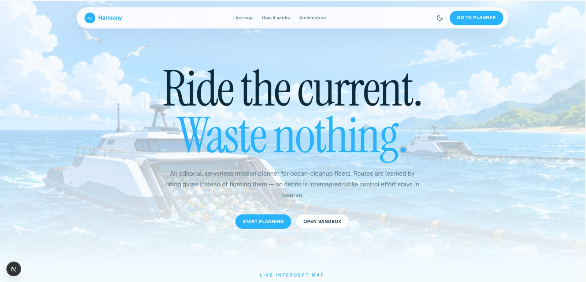
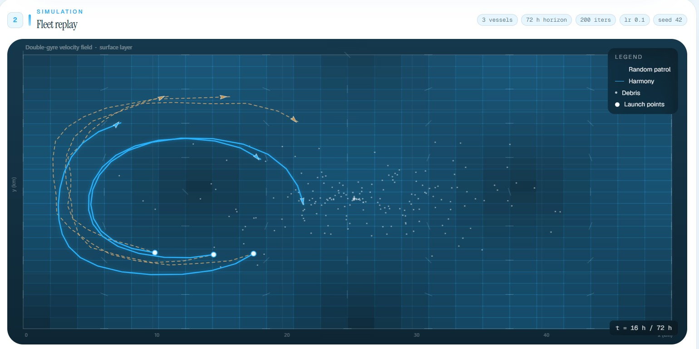

# 🌊 Harmony: Order from Chaos


[](https://d32eo4z8j4qsxd.cloudfront.net)

> *“We don't fight the ocean; we learn to dance with it.”*

<p align="center">
  
</p>

---

## The "Why" (Our Story)

Every year about **8 million tons of plastic enter the ocean** — and it doesn't stay
still. It gets captured by geostrophic currents: gyres, eddies, and jets that are
chaotic, non-linear, and always moving.

Most cleanup strategies are **reactive**: vessels patrol a grid regardless of the
current, or a model says "trash will be *there*" and the boat drives straight at it —
fighting the very current that moves the debris. That's an energy-negative loop:
burning fuel to chase something that flows faster than you can predict.

We built **Harmony** because we believe there's a smarter control problem hiding in
there. Instead of *predicting where the debris will be and racing to it*, we treat the
ocean as a differentiable physical system and let a gradient tell the boats how to
ride it. It's the difference between fighting the river and sailing with it — and
it happens to run fully serverless on AWS.

## What It Does

Harmony is a mission planner you can actually use on demo day:

1. Configure a fleet — vessels, mission horizon, debris density, an **objective**
   (balanced / max collection / min control effort) and a boundary-penalty toggle.
2. `POST /mission`, and the engine runs **Random Patrol** (baseline) and **Harmony**
   (gradient optimization over the full rollout) on the *identical* current field.
3. Watch both fleets animated side-by-side: scrub the timeline, read KPIs (debris
   recovered, **control effort** used, efficiency gain, first-capture hour), and a
   loss-over-iterations sparkline that proves the gradient walked every step.
4. Ask the **Copilot** — "why did Harmony win?" — for a plain-English explanation,
   generated by OpenAI about *that exact run* (with a static fallback offline).

Offline-safe: if the API is unreachable the app falls back to a seeded mock ocean, so
a demo never dies from a network blip.

## Use Cases

- **Field ops planning** — before committing a crew and fuel, an NGO can scrub a
  candidate route against the same currents and see projected recovery vs. fuel.
- **What-if drills** — fleet size / horizon / deployment-location trade-offs in
  seconds, no risk, no ocean.
- **Teaching differentiable optimization** — a tangible, animated example of
  backprop through an ODE, with the loss sparkline making it legible.
- **Control-theory showcase** — the same "optimize control sequences in a
  differentiable simulator" pattern transfers to any flow/field problem.

## How It Works (the technical part)

Harmony inverts the paradigm: **don't just predict the debris — control the vessel
within the flow.** The core is a differentiable simulation pipeline built on PyTorch,
so we can backpropagate loss gradients *through time* to tune vessel controls.

### 1. Differentiable ocean field (`api/harmony/ocean_field.py`)

The ocean is modeled not as a discrete grid (which breaks gradients) but as a
**continuous vector field** `F(x, y, t)`:

- **Bilinear interpolation** (`grid_sample`-style) turns discrete hydrographic data —
  current `u`, `v` vectors — into a smooth surface.
- For any position `p = (x, y)`, the velocity `v = F(p)` is **differentiable with
  respect to position** — which is what lets the optimizer "know" which direction
  leads into stronger currents.

The engine reads only `u/v/x/y` arrays, so it's dataset-agnostic: it ships with a
synthetic **double-gyre** field and can swap in real NASA OSCAR currents by pointing
`HARMONY_DATA` at another file.

### 2. Physics engine & RK4 integrator (`api/harmony/particle_simulator.py`)

Most physics engines are black boxes — inputs in, positions out. We wrote a
**fourth-order Runge–Kutta (RK4)** integrator entirely in PyTorch tensors:

$$ p_{t+1} = p_t + \tfrac{1}{6}(k_1 + 2k_2 + 2k_3 + k_4) \cdot \Delta t $$

Because every integration step is differentiable, unrolling the simulation for `T`
timesteps (e.g., 72 hours) yields one computation graph connecting initial thrust
`u₀` to final position relative to the debris `p_T`. We can literally compute:

$$\frac{\partial\, \text{distance to debris}}{\partial\, \text{thrust}}$$

*"How does changing my thrust at hour 1 affect my catch at hour 72?"*

### 3. Gradient-descent control (`api/harmony/optimizer.py`)

Route planning is an **optimization problem**, not reinforcement learning — no sample
inefficiency, deterministic results:

$$\mathcal{L} = -\sum_{t}\text{Captured}(d_t, v) + \lambda \sum_{t}\|u_t\|^2$$

- `Captured` is a soft Gaussian kernel (keeps "capture" differentiable)
- `‖uₜ‖²` is the fuel cost · `λ` the trade-off hyperparameter

Minimizing `L` with Adam, the vessels *discover* complex behaviors on their own —
riding an eddy to gain speed, or waiting for debris to come to them — without ever
being explicitly programmed to do so.

## Results & Visualization

Benchmarked on the **double-gyre** test case (seed 42, 200 debris, 3 vessels, 72 h) —
both fleets run on the *identical* current field:

| Metric | Random patrol | Harmony | Δ |
| --- | ---: | ---: | ---: |
| **Debris recovered** | 6 | **7** | **+16.7%** |
| **Control effort** | 450.4 | **164.2** | **−63.5%** |
| **First capture** | hour 9 | **hour 4** | 5 h earlier |
| **Compute time** | — | tens of seconds (CPU Lambda) | — |



- **Random patrol (orange):** straight segments, often cutting *against* the
  streamlines and burning fuel to fight the flow; misses the dense clusters forming
  in the gyre centers.
- **Harmony (blue):** highly curved paths — the optimizer exploiting the vorticity of
  the field, looping into the gyre centers and aligning with streamlines to hold
  speed at lower thrust.

## AWS — What We Used, How, and Feedback

Everything provably runs on AWS, end to end, on a free-tier-shaped footprint.

| Service | Role here | Notes / feedback |
| --- | --- | --- |
| **Lambda** (container) | FastAPI + CPU PyTorch solver, copilot, history, via the Web Adapter | **Web Adapter makes FastAPI on Lambda trivial**; cold start acceptable at demo scale |
| **Lambda Function URL** | Public HTTPS entry for the web app | *Strong win:* no 30 s integration cap — a 20–60 s solve doesn't time out |
| **API Gateway** (v2) | Alternate `/api/*` proxy | **Feedback:** its **30 s timeout is incompatible with long ML inference** — reached for Function URL instead |
| **DynamoDB** | `missions` table — mission history | Zero ops. Caveat: **`metrics` is a reserved word** — it silently broke our scan for hours |
| **S3** | Static site origin + current data | Public-read demo hosting; `--delete` sync keeps deploys clean |
| **CloudFront** + **Functions** | CDN + `harmony-viewer-rewrite` route fix | **Feedback:** S3+REST origin doesn't resolve directory indexes — `/planner` 403'd until the edge function rewrote routes |
| **SSM Parameter Store** | `/harmony/openai-key` (SecureString) | Secret never hits the repo or the frontend |
| **ECR** | The PyTorch container image | First image build ~15–30 min — one-time cost |
| **IAM · CloudWatch · CloudFormation** | Least-privilege roles, logs, reproducible stack | CloudWatch is how we finally caught the silent DynamoDB failure |

## Repo Layout

```
api/                     FastAPI service + engine
  harmony/               differentiator (ocean_field, particle_simulator, optimizer)
  app/                   main.py (HTTP), runner.py (headless), explain.py (LLM copilot)
  scripts/               generate_data.py (synthetic) · fetch_real_data.py (OSCAR)
  tests/                 smoke tests (same as CI)
  Dockerfile             Lambda container (Web Adapter)
app/  components/  lib/  Next.js 16 static-export UI
data/                    ocean current .npz + a sample mission response
infra/                   deploy scripts (API, web) + CloudFront function
docs/                    images/ + docs/TODO.md (submission checklist)
.github/workflows/ci.yml CI: lint/tsc/build + pytest (CPU torch)
```

## Getting Started

### Run locally — API

```bash
cd api
pip install -r requirements.txt
python -m uvicorn app.main:app --reload --port 8000   # POST localhost:8000/mission
```

### Run locally — web

```bash
npm install
npm run dev                    # http://localhost:3000 (calls :8000)
```

Offline-safe: blocked network → the UI falls back to a seeded mock
(`lib/mock-mission.ts`); point elsewhere with `NEXT_PUBLIC_API_URL`.

### Deploy on AWS

```bash
aws configure                     # us-east-1
./infra/scripts/deploy-api.sh     # first run builds the container (~15–30 min)
NEXT_PUBLIC_API_URL=<function-url> ./infra/scripts/deploy-web.sh   # → CloudFront URL
aws ssm put-parameter --name /harmony/openai-key --type SecureString --value sk-…
```

### Real ocean data (optional)

```bash
pip install xarray netCDF4 requests
python api/scripts/fetch_real_data.py --region bay-of-bengal --write data/gulf_stream.npz
```

## Demo Checklist (for the 3-minute video)

1. Landing → stats + live link → open the planner
2. `/planner` defaults: 3 vessels, 72 h, seed 42 → **Run mission**
3. Side-by-side animation: Harmony curves into gyre centers, patrol fights the flow
4. KPI strip: +16.7% recovery, −63.5% control effort + loss sparkline
5. Objective presets (balanced / max collection / min control effort) + boundary toggle
6. **Copilot**: "Why did Harmony win?" → OpenAI explanation + `source: openai` badge
7. `/history` → DynamoDB rows → **Replay** the same params via `?id=`
8. Resilience: kill the network → planner still solves the seeded gyre

## Challenges Faced

Real hurdles, not the polished version:

1. **DynamoDB reserved words.** A column named `metrics` is reserved. Our scan
   silently returned `[]` — two deploys and a CloudWatch dive before the
   `ValidationException` surfaced. Fix: alias every projection attribute via
   `ExpressionAttributeNames`.
2. **Silent deserialization bug.** The low-level `TypeDeserializer` must be applied
   *per attribute*, not per item — a subtle misuse returned an empty list without a
   single error.
3. **Static exports can't serve a directory index.** Next.js export emits
   `planner/index.html`, but S3+REST+CloudFront won't resolve `/planner/` for you.
   Every internal link 403'd until a CloudFront Function rewrote clean URLs.
4. **API Gateway's 30-second ceiling.** Mission solves (tens of seconds) would time
   out — the web app moved to **Lambda Function URL**, no integration cap.
5. **The 15-minute container build.** Serverless is one-shot; the first
   `deploy-api.sh` is slow and you must not Ctrl+C it. Worth it for the payoff.
6. **No dynamic routes in static export.** Replay works by reading
   `window.location.search` (`?id=`) and re-solving the same params — there's no
   `/mission/[id]` page.

## Tech Stack

| Layer | Choice |
| --- | --- |
| Differentiable engine | **Python 3.11 + PyTorch 2** (custom RK4, bilinear field, Adam) |
| API | **FastAPI** on **Lambda** (container + Web Adapter) |
| History | **DynamoDB** (mission rows, newest-first) |
| ML copilot | **OpenAI `gpt-4o-mini`**, key in **SSM**, static fallback offline |
| Frontend | **Next.js 16** (Turbopack, `output: export`), React 19, Tailwind |
| Delivery | **S3 + CloudFront** + **CloudFront Function** nav rewrite |
| Infra | **CloudFormation / SAM**, deploy scripts in `infra/` |
| CI | **GitHub Actions** — lint/tsc/build + pytest (CPU torch) |

## Security & Privacy

- The OpenAI key lives in **SSM Parameter Store (SecureString)** — never in the repo,
  never in the frontend bundle; Lambda fetches it at runtime via a least-privilege
  IAM policy.
- Backend routes are **CORS-open** by design so any origin can demo the copilot.
- The DynamoDB table and function aren't publicly writable — only the documented API
  paths are exposed.

## Hackathon Context

- **Event:** First Commit | Bharat Builds Tour (WeMakeDevs × AWS) — 16,000
  participants worldwide, 1,400+ on the ground in Bangalore.
- **Team:** Team Titan (code `BP57CZ`) · Submission deadline: Sep 20 EOD.
- **Scope choice:** live MVP over video generation; everything on the deployed site is
  real and reproducible.

### The team + who did what

| Member | Owned |
| --- | --- |
| **Kumar Nirupam** ([GitHub](https://github.com/KumarNirupam1)) | Differentiable engine (field / RK4 / optimizer), FastAPI + Lambda · API GW · DynamoDB · SSM, CI, data + benchmarks, deployment, this README |
| **Sanket Singh** ([GitHub](https://github.com/sanketsingh01)) | Next.js planner UI, mission history + replay, copilot panel, objective/boundary controls, brand SVGs + OG metadata |

### AI tooling disclosure

Planning and implementation were pair-programmed with **opencode** beside
manual system design and product decisions, per hackathon rules. Every number above
is measured from the deployed system — nothing is generated-for-demo.

---

<div align="center">Made by <b>Team Titan</b> — [Kumar Nirupam](https://github.com/KumarNirupam1) & [Sanket Singh](https://github.com/sanketsingh01)</div>